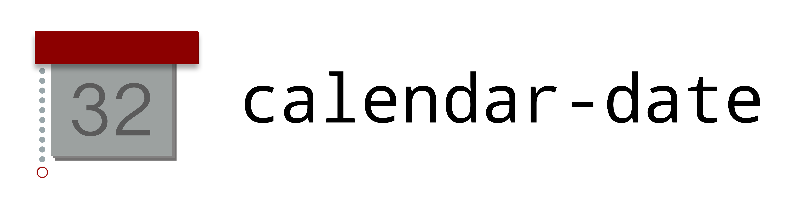

#

_Zero-depenency, small, immutable library for handling calendar dates **correctly**._

`typescript-calendar-date` works on objects like `{ year: 2021, month: 'jan', day: 1 }` which you can easily construct and destructure anywhere in your app. 
The library provides a small set of powerful functions which are easy to understand and use. No more date bugs!

## Philosophy

Everyone gets dates wrong, especially programmers. If asked to calculate how many days old he is, a programmer would convert the current date and time, say `Date.now()`, to the number of seconds since Unix epoch, 1970, or just epoch time, for short.
Then he would convert the middle of the day, or even midnight, in some arbitrary timezone, of when he was born, say `April 1, 1990`, to a number representing the number of seconds he was born after epoch.
Then he would subtract these two numbers, and finally, divide by some constants representing the number of seconds in a day.

This is insane. Just count the number of days! Calendars were invented by humans to be useable by humans, so lets program them directly. It's fairly easy, the most complicated part
of our modern calendar, the Gregorian Calendar, is leap years: every fourth, but not every hundreth, except every four-hundreth. Luckily this library encapsulates all that complexity for you!

Things you can do with this library therefore relate to calendar dates, not absolute time. Luckily, this is usually what most business and everyday applications require.
You can for instance count how many days old you are, or you can find out how many days are in the current month. You can also find out if two dates are sequential, if a certain date is "in range"
of two other dates, and you can generate a list of all dates between two specific dates, for instance if you want to iterate through it.

What this library does not do is handle time of day or timezones. This is largely actually irrelevant anyway, but if this is what you want to do, I would still consider if a Calendar Date and separately storing
the time and location, might be a good idea. Unsolicited advice: if what you actually want is epoch timestamps (for instance in some kind of bidding or auction application), just store the epoch timestamp as an integer, and stop worrying about dates! It'll make your life a whole lot easier. And probably your code more correct.

Another idea behind this library is to be lightweight and transparent, as well as explicit, which leads me to the inevitable conclusion that the primary data type has to be transparent; that is it is just a regular javascript value with the keys `year`, `month` and `day`. This also means I expect you to parse your own data, for instance ISO 8601 date strings, and construct this object yourself. I provide no constructors. The reasoning is that this gives you explicit visibilty into how it works and you can be totally confident that it does the right thing. Sadly it does mean a bit more work to use the library, but I belive this tradeoff is worth it. It's just a matter of writing a single functions you can put in a utils file or whatever. Secondly, the same goes for formatting. This part is even more important that you are in control of I believe, as no one knows how you want to display the data to your users better than you. And date formats are notoriously difficult to internationalize, and differ even between contexts. In logs it makes sense to have dates of the form `2020-03-12`, but users might want to see `March 12`, `March 12, 20200`, or even `12th of March`. So I give you this responsibility, but in turn I try to make the interface, that is the shape and structure, of the data as lightweight and predictable as possible.

## Examples

So say you did want to perform the calculation of how many days old you are.

```typescript
const birthDate: CalendarDate = { year: 1990, month: 'apr', day: 1 };

const today = {
    year: new Date().getFullYear(),
    month: monthName(new Date().getMonth() + 1),
    day: new Date().getDate(),
};

const daysOld = numberOfDaysBetween({ start: birthDate, end: today });
```

Here we see the first concession I had to make in terms of useability. I've decided to represent the month as a three-letter string, using the English abbreviation. It would have been a lot more convenient for sure to just use an int, but that runs into the question of zero-indexing or not. Although the right answer in this context is probably to one index, that is January is the first (1) month, but there is no way around developer confusion here. I did want to end up in a situation where you always had to second guess yourself and double check the documentation. So here I've gone with a string for explicitness, which unfortunately does mean you sometimes have to call `monthName` to get the string representation - but hopefully you only need to do this in parsing functions at the edge of your program. The other benefits of doing it this way is that it's super easy to debug and look at your data - no doubt that when you see the value `{ year: 2022, month: 'aug', day: 28 }` in your console, it means `August 28th, 2022`. This also discourages manipulating the month directly, there is now no easy way to attempt to increment it without using the library-provided functions. You can of course still do this with the `day`, but please don't - it'll just lead to bugs. However you *can* do this with the `year` part as there are no edge cases to incrementing or decrementing years diretly. And lastly it makes it obvious that you need to explicitly format the data for display purposes, at the same time keeping it simple to write such a function (for instance, `'aug'` becomes `'August'` or `8` or whatever you want, but it forces you to make a decision).

It's always tricky to know which way around these kind of "subtraction" operations work, so I've decided to go with named parameters in `numberOfDaysBetween`, hopefully making it clear which goes where. If you get it backwards, you get a flipped sign. 

Another gothca is you have to explcititly annotate `birthDate` with the type `CalendarDate`, otherwise TypeScript infers too wide a type for `month`, namely string, which won't work. An alternative design here is to use an explicit enum for the `month` type (or an int as discussed earlier). Please let me know if this string business gets to annoying, and you'd like another approach - I'm very open to input here.

Alright, a simpler example! You've been given two dates, and you want to know if one becomes before the other. In other words, you wish to know if they are in the correct order.

```typescript
const foo = (from: CalendarDate, to: CalendarDate) => {
    if (!areInOrder(from, to)) {
        throw ...
    }
    ...
};
```

Here too I hope disambiguate the order of the parameters by calling the function `isInOrder`, in an attempt to make it obvious that two dates are in order if the first appears before the second. But to make this api even more useful, you can actually pass in more parameters! An often useful thing to know if whether some third date is *between* the other two (is this thing in that range?). Let me give you an example.

Say your billing department wants to do a different thing if a given date is in the fiscal year's first quarter.

```typescript
const foo = (date: CalendarDate) => {
    const startOfQ1: CalendarDate = { year: 2021, month: 'jan', day: 1 };
    const endOfQ1 = lastDateInMonth({ year: 2021, month: 'mar' });

    if (areInOrder(startOfQ1, date, endOfQ1)) {
        ...
    } else {
        ...
    }
};
```

My opinion is this code does exactly what you intuitively think it should do. You have two values representing the start of and the end of the quarter, respectively - then you test if your date is *between* those dates - inclusively, of course. For convenience, `areInOrder` takes an arbitrary number of dates, so you can express some pretty complex relationships using just one or a few function calls.

If you're wondering about `lastDateInMonth`, you could just create `{ year: 2021, month: 'mar', day: 31 }` directly in the same way you construct the first day of the year (`startOfQ1`), but I think it's cleaner and safer to just use `lastDateInMonth` always, both because it's very explicit of what you want, and you don't risk mis-remembering which months have how many days - and of course it also handles leap years correctly. I don't provide a `firstDateInMonth`, although you are welcome to create one for yourself. The reasoning for this is that I want to be excplicit about showing you where the complexity in this domain (calendar dates) lies - it's relatively much more tricky to express the idea of the last day in a month, than the first. There is a certain tempting symmetry of providing both `firstDateInMonth` and `lastDateInMonth`, but this would be a kind of "api lie", exactly because this pleasing symmetry is false.